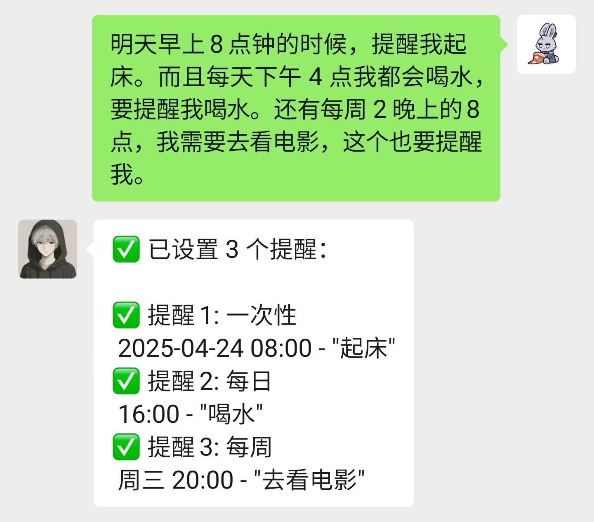
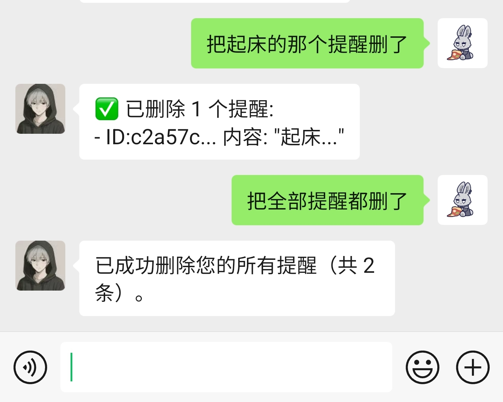
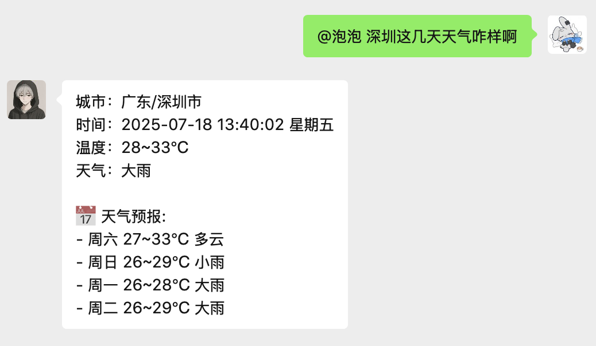

<div align="center">

# 🫧 Bubbles - WechatAI 🫧

*我叫 泡泡（Bubbles） - 一个致力于链接万物的个人微信助手*

</div>

<p align="center">
  
  
  
  
</p>

> ✉️ 致来访者
>
> 我一直在尝试做一个全面的的生态助手（个人助理），能够连接我使用的任何工具、日程表、数据库、资料库。并基于数据资料，实时地和我交流，以及帮我安排日程、提醒、规划时间和出行，安排我的任务计划。甚至于查资料、做研究、处理工作、回老板微信（帮我上班）。
>
> 之前做了 [LifeSync-AI](https://github.com/Zippland/LifeSync-AI) 这个项目，核心思想是基于 Github Action、Notion、Zapier进行app互联，帮我进行每天的任务规划。但定时任务是被动的，而且缺少一个统一的数据处理中心，所以无法通过与用户交流进行实时的任务调度。
>
>于是我在好奇，是否能使用聊天工具，通过和AI直接对话的形式，再通过 function call 或者 MCP Server 链接到工具，进而链接我的所有需求。
>
> **这就是这个项目的初衷。**
>
> 玩得开心，
>
> Zylan
>


## 📝 项目简介

Bubbles 是一个功能丰富的微信机器人框架，基于 [wcferry](https://github.com/lich0821/wcferry) 和 [WechatRobot](https://github.com/lich0821/wechatrobot) 开发，支持接入多种LLM，提供丰富的交互功能和定时任务。该项目旨在将微信客户端转变为一个智能的个人助手，可以执行多种实用功能，带来便捷的用户体验。

和一般机器人框架不同的是，Bubbles 设计了两套灵活的路由系统：

1. **命令路由系统** - 基于正则表达式的精确命令匹配，适合有明确触发词的功能
2. **AI智能路由系统** - 基于AI的自然语言理解，自动识别用户意图并调用相应功能

通过这两套路由系统，添加新功能变得极其简单，且不需要改动原有代码。相当于给一个主线 Hub 添加插件，让海量的、不同种类的工具都能集成到 AI 里。具体操作详见 **如何添加新功能** 章节。


#### 案例演示其一：使用自然语言设置提醒（命令路由）

结构：
1. 用户输入 -> agent分析 -> agent格式化输出 -> 选择函数 -> 格式解析 -> 函数循环调用 -> 数据库持久化 -> 结果回调
2. 每分钟扫描一次数据库，判断当前时间 -> （存在超时任务） -> 访问数据库 -> 整合近期context -> 回传agent -> 输出提醒 -> 回调打印

 

 

#### 案例演示其二：使用自然语言设置提醒（AI 智能路由

结构：
用户输入 -> agent分析 -> agent格式化输出 -> 选择函数 -> 格式解析 -> 函数调用 -> 接口访问 -> 查询数据 -> 数据库持久化 -> 结果回调

 

## ✨ 核心特性

#### 🤖 灵活的模型配置
- 支持为不同的群聊和私聊设置不同的 AI 模型和 system prompt
  - OpenAI (ChatGPT)
  - DeepSeek
  - Perplexity

#### 🛠️ 双重路由系统
- **命令路由系统**：基于正则表达式的精确匹配，高效处理特定命令
- **AI智能路由**：自然语言理解，无需记住特定命令格式
- 支持自定义命令及参数
- 预设 [多种实用和娱乐命令](#可用命令)

#### ⏰ 定时任务与提醒功能
- 每日天气预报推送
- 每日新闻资讯推送
- 工作日报/周报/月报提醒
- 个人自定义提醒系统（通过自然语言设置定时提醒）

#### 📊 对话管理
- 智能消息总结功能
- 处理各类微信消息（文本、图片、小程序、链接等）

#### 🔧 实用工具
- 自动接受好友请求并打招呼
- 自动响应群聊和私聊消息

## 🛠️ 安装指南

#### 系统要求
- Python 3.8 或更高版本
- Windows 操作系统（wcferry 要求）
- 微信 PC 版客户端
- 云配置要求（如需）：2vCPU 2GiB （经济型）

#### 安装步骤

1. **克隆仓库**
   ```bash
   git clone https://github.com/zippland/Bubbles.git
   cd Bubbles
   ```

2. **创建并激活虚拟环境（可选但推荐）**
   ```bash
   python -m venv .venv
   .venv\Scripts\activate
   ```

3. **安装依赖**
   ```bash
   pip install -r requirements.txt
   ```

4. **配置项目**
   ```bash
   # 复制配置模板
   cp config.yaml.template config.yaml
   
   # 编辑配置文件，填入您的 API 密钥等信息
   notepad config.yaml
   ```

## ⚙️ 配置说明

配置文件 `config.yaml` 包含以下主要部分：

#### AI 模型配置

每个 AI 模型都有自己的配置部分，例如：

```yaml
# ChatGPT 配置
CHATGPT:
  key: "your-openai-api-key" # 填写你 ChatGPT 的 key
  api: "https://api.openai.com/v1"
  model: "gpt-4.1-mini"  # 可选：gpt-4, gpt-3.5-turbo 等
  proxy: "http://127.0.0.1:7890"  # 可选：如需代理请填写
  system_prompt: "你是一个有用的助手。"
  max_history_messages: 20 # 设置 ChatGPT 默认最多回顾 20 条历史消息
```

#### 群组/私聊模型映射

您可以为不同的群聊或私聊指定不同的 AI 模型：

```yaml
# 群组模型配置
GROUP_MODELS:
  # 默认模型 ID
  default: 1  # 1 代表 CHATGPT
  
  # 群聊模型映射
  mapping:
    - room_id: "12345678@chatroom"  # 群聊 ID
      model: 1  # 1 代表 CHATGPT
      max_history: 30  # 回顾最近30条消息

  # 私聊模型映射
  private_mapping:
    - wxid: "wxid_abc123"  # 用户 wxid
      model: 2  # 2 代表 Deepseek
      max_history: 50  # 回顾最近50条消息
```

#### 功能开关

您可以启用或禁用各种功能：

```yaml
# 功能开关
  news_report # 每日新闻推送
  weather_report  # 每日天气推送
  report_reminder # 日报周报月报提醒
  image_generation  # AI生图
  perplexity  # perplexity
```

## 🚀 使用方法

#### 启动机器人

```bash
python main.py
```

#### 可用命令

机器人支持多种命令，按功能分类如下：

##### 提醒功能
- `..提醒我..` - 用自然语言设置一个或多个提醒
- `查看提醒`、`我的提醒`、`提醒列表` - 查看您设置的所有提醒
- `..删..提醒..` - 用自然语言删除指定的（或所有）提醒

##### 基础系统命令
- `info`、`帮助`、`指令` - 显示机器人的帮助信息
- `骂一下 @用户名` - 让机器人骂指定用户（仅群聊）

##### Perplexity AI 命令
- `ask 问题内容` - 使用 Perplexity AI 进行深度查询（需@机器人）

##### 消息管理命令
- `summary`、`/总结` - 总结群聊最近的消息（仅群聊）
- `clearmessages`、`/清除历史` - 从数据库中清除群聊的历史消息记录（仅群聊）

##### 天气和新闻工具
- `天气预报 城市名`、`预报 城市名` - 查询指定城市未来几天的天气预报
- `天气 城市名`、`温度 城市名` - 查询指定城市的当前天气
- `新闻` - 获取最新新闻

##### 决斗系统命令（默认关闭）
- `决斗 @用户名` - 发起决斗（仅群聊）
- `偷袭 @用户名`、`偷分 @用户名` - 偷袭其他玩家（仅群聊）
- `决斗排行`、`决斗排名`、`排行榜` - 查看决斗排行榜（仅群聊）
- `决斗战绩`、`我的战绩`、`战绩查询` - 查看决斗战绩（仅群聊）
- `我的装备`、`查看装备` - 查看自己的装备（仅群聊）
- `改名 旧名称 新名称` - 更改昵称（仅群聊）

## 📋 项目结构

```
Bubbles-WechatAI/
├── ai_providers/       # AI 模块
│   ├── ai_name.py      # AI 模型接口实现
│   └── ...
├── commands/           # 命令系统
│   ├── registry.py     # 正则命令注册
│   ├── handlers.py     # 命令处理函数
│   ├── ai_router.py    # AI智能路由器
│   ├── ai_functions.py # AI路由功能注册
│   └── ...
├── data/               # 数据文件
│ 
├── function/           # 功能模块
│   ├── func_feature.py # 各种功能的具体实现
│   └── ...
├── config.yaml         # 配置文件
└── ...
```

### ✨ 如何添加新功能

本项目提供两种方式添加新功能：

#### 方式一：使用命令路由系统（适合有明确触发词的功能）

1.  **定义功能逻辑 (可选但推荐)**:
    *   如果你的功能逻辑比较复杂，建议在 `function/` 目录下创建一个新的 Python 文件 (例如 `func_your_feature.py`)。
    *   在这个文件中实现你的核心功能代码，例如定义类或函数。这有助于保持代码结构清晰。

2.  **创建命令处理器**:
    *   打开 `commands/handlers.py` 文件。
    *   添加一个新的处理函数，例如 `handle_your_feature(ctx: 'MessageContext', match: Optional[Match]) -> bool:`。
    *   这个函数接收 `MessageContext` (包含消息上下文信息) 和 `match` (正则表达式匹配结果) 作为参数。
    *   在函数内部，你可以：
        *   调用你在 `function/` 目录下创建的功能模块。
        *   使用 `ctx.send_text()` 发送回复消息。
        *   根据需要处理 `match` 对象提取用户输入的参数。
        *   函数应返回 `True` 表示命令已被处理，`False` 则表示未处理 (会继续尝试匹配后续命令或进行闲聊)。
    *   确保从 `function` 目录导入必要的模块。

3.  **注册命令**:
    *   打开 `commands/registry.py` 文件。
    *   在 `COMMANDS` 列表中，按照优先级顺序添加一个新的 `Command` 对象。
    *   配置 `Command` 参数：
        *   `name`: 命令的唯一标识名 (小写下划线)。
        *   `pattern`: 用于匹配用户输入的正则表达式 (`re.compile`)。注意捕获用户参数。
        *   `scope`: 命令适用范围 (`"group"`, `"private"`, `"both"`)。
        *   `need_at`: 在群聊中是否需要 `@` 机器人才能触发 (`True`/`False`)。
        *   `priority`: 命令的优先级 (数字越小越优先匹配)。
        *   `handler`: 指向你在 `handlers.py` 中创建的处理函数 (例如 `handle_your_feature`)。
        *   `description`: 命令的简短描述，用于帮助信息。
    *   确保从 `handlers.py` 导入你的新处理函数。

4.  **更新帮助信息 (可选)**:
    *   如果希望用户能在 `帮助` 命令中看到你的新功能，可以更新 `commands/handlers.py` 中的 `handle_help` 函数，将新命令的用法添加到帮助文本中。

#### 方式二：使用AI智能路由（适合自然语言交互的功能）

AI路由系统让用户可以用自然语言触发功能，无需记住特定命令格式：

1. **实现功能逻辑**:
   * 在 `function/` 目录下创建功能模块（如已有则跳过）

2. **注册AI路由功能**:
   * 打开 `commands/ai_functions.py`
   * 使用装饰器注册你的功能：
   ```python
   @ai_router.register(
       name="your_function_name",
       description="功能描述（AI会根据这个判断用户意图）",
       examples=[
           "示例用法1",
           "示例用法2",
           "示例用法3"
       ],
       params_description="参数说明"
   )
   def ai_handle_your_function(ctx: MessageContext, params: str) -> bool:
       # params 是AI从用户输入中提取的参数
       # 调用你的功能逻辑
       # 使用 ctx.send_text() 发送回复
       return True
   ```

3. **工作原理**:
   * 用户发送消息时，如果正则路由未匹配，AI会分析用户意图
   * AI根据功能描述和示例，判断应该调用哪个功能
   * AI会自动提取参数并传递给功能处理函数

例如，注册了天气查询功能后，用户可以说：
- "北京天气怎么样"
- "查一下上海的天气"
- "明天深圳会下雨吗"

AI都能理解并调用天气查询功能。

完成以上步骤后，重启机器人即可测试你的新功能！

## 📄 许可证

本项目采用 Apache 2.0 许可证，详情请参阅 [LICENSE](LICENSE) 文件。

## 🙏 致谢

- [wcferry](https://github.com/lich0821/wcferry) - 提供微信机器人底层支持
- 所有贡献者和用户

## ❓ 常见问题

**Q: 如何获取群聊 ID？**
A: 在群聊中发送一条消息，机器人日志会显示该消息的来源群聊 ID。

**Q: 如何添加新的 AI 模型？**
A: 在 `ai_providers` 目录下创建新的模型接口实现，然后在 `robot.py` 中注册该模型。

**Q: 出现 "AI 模型未响应" 错误怎么办？**
A: 检查相应 AI 模型的 API 密钥配置和网络连接，确保 API 可访问。

**Q: 机器人不回复消息怎么办？**
A: 检查 wcferry 服务是否正常运行，查看日志文件了解详细错误信息。

## 📞 联系方式

如有任何问题或建议，请通过以下方式联系我们：

- GitHub Issues: [提交问题](https://github.com/zippland/Bubbles/issues)
- Email: zylanjian@outlook.com

---

**注意**：本项目仅供学习和个人使用，请遵守微信使用条款，不要用于任何违反法律法规的活动。
